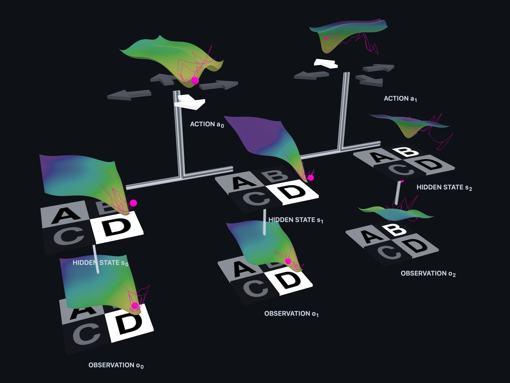

# Thermodynamic Reasoning – p-bit POMDP

**Live demo: https://glawleschkoff.github.io/thermodynamic-reasoning/**

Sixteen coupled p-bits governed by double-well Langevin dynamics encode a POMDP (three hidden states, three observations, and two actions), realizing perception, planning, and action via thermal relaxation. The interactive 3D viewer visualizes the trajectories across continuous energy surfaces alongside empirical state distributions and exact analytical Bayesian posteriors.

## Structure
- `pbits/model.py` – parameters, coupling matrix J, clamping plan
- `pbits/simulate.py` – Langevin simulation (JAX) and the ensemble used for the probabilities
- `pbits/bayes.py` – exact Bayes posteriors (reference, derived in `notebooks/test.ipynb`)
- `pbits/export.py` – writes `viewer/data.js`
- `run.py` – run the simulation and export the data
- `dev.py` – local server (port 8000); re-runs `run.py` when the Python files change
- `docs/` – browser viewer (three.js), also served by GitHub Pages; `docs/vendor` and `docs/assets` are stored locally
- `archive/` – older variants and iterations (not part of the repository)

## Usage
    pip install -r requirements.txt
    python3 run.py      # simulation -> docs/data.js
    python3 dev.py      # http://localhost:8000

## Demo
The viewer is static. On GitHub Pages choose "Deploy from a branch", branch `main`, folder `/docs`.
`docs/data.js` is part of the repository, so no Python is needed to view the demo.

## Credits and licenses
- Code: MIT, see `LICENSE`.
- Bee model: "Cube Pets" by Kenney (kenney.nl), CC0.
- Honeycomb model: "Honeycomb" by Poly by Google [CC-BY]
  (https://creativecommons.org/licenses/by/3.0/) via Poly Pizza (https://poly.pizza/m/6Mqdrv1n3Oo).
  Used unchanged except for scaling, rotation and placement.
- three.js (MIT), included in `docs/vendor`.
